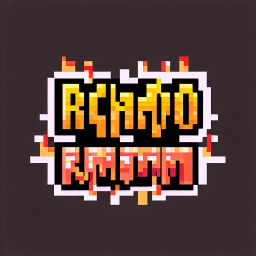
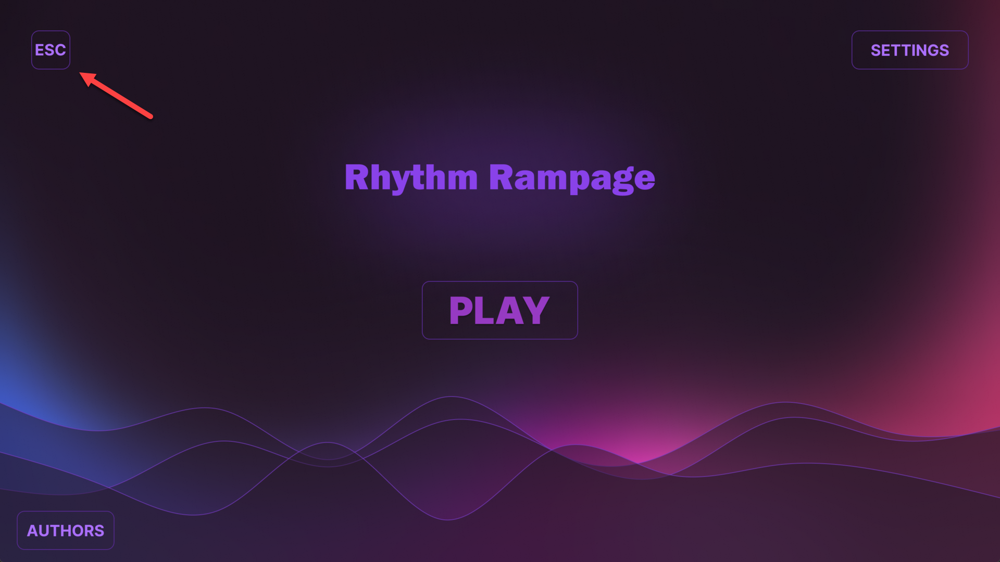
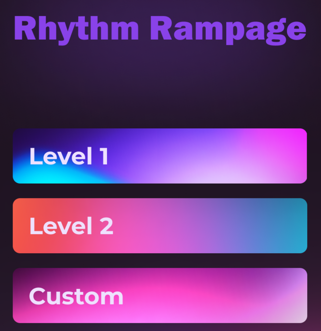
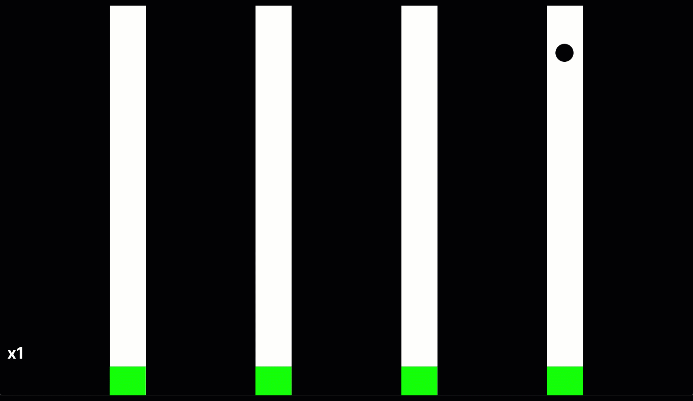
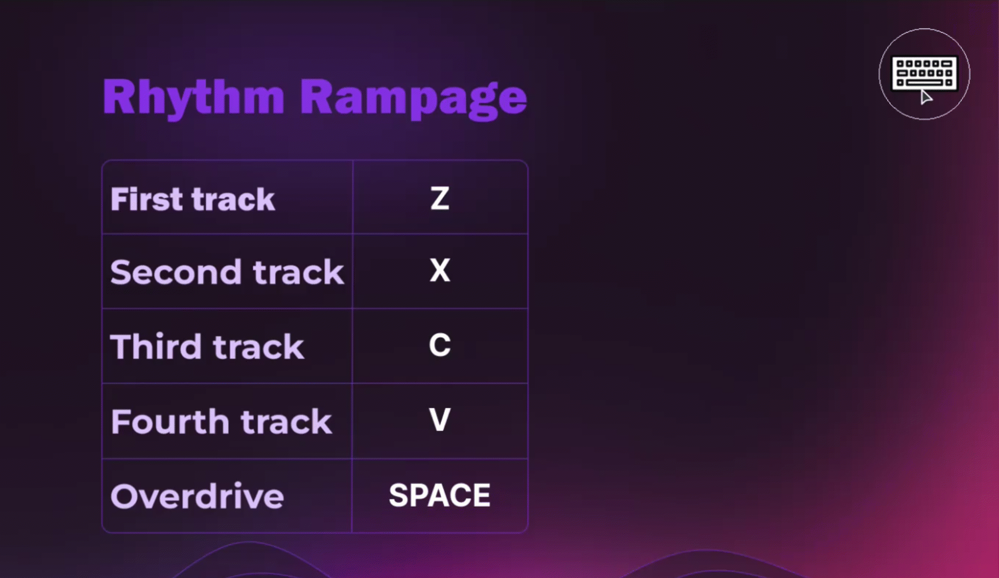
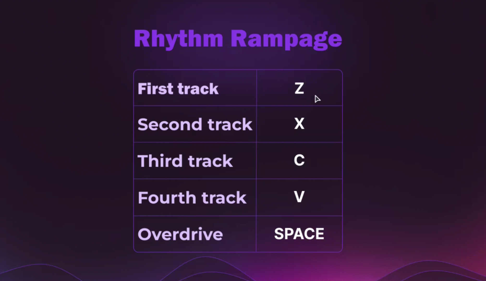
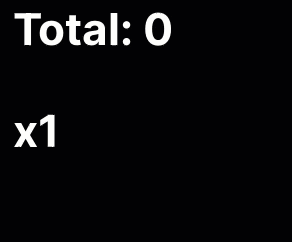
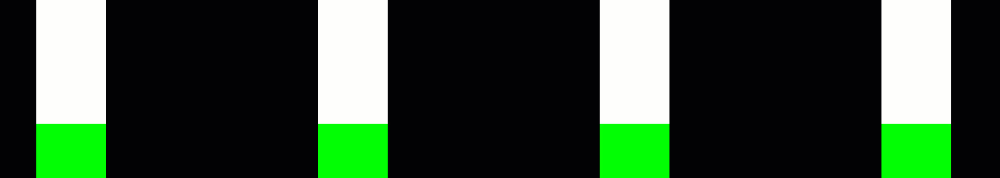

# Rhythm Rampage

### Компьютерная ритм игра - *Rhythm Rampage*, копия гитар хиро.
*Управление в игре с клавиатуры и геймпада.*  

### Авторы:

[Андрей Орлов](https://github.com/vokintru)

[Никита Иванников](https://github.com/Nikiton-prog)

### Помогали:

[Zefjrka (Дизайн)](https://github.com/Zefjrka)

### Описание

 - Игра открывается на весь экран из-за этого в интерфейсе игры предусмотрена кнопка выхода

 - В меню можно выбрать 2 предустановленных уровня, и запустить кастомный если он установлен

 - В игре нужно в ритм музыке нажимать на 4 клавиши управления

 - В настройках можно выбрать устройство ввода (Геймпад Xbox/Клавиатура), геймпады PlayStation не поддерживаются

 - Каждую клавишу управления можно назначить на другую

Игровые индикаторы:
 - Стрик это множитель в левом нижнем углу, он показывает сколько сочков вы будете получать за ноту (50 * на стрик)
 - Голубые полоски это индикатор заполнения стрика, при 8 палочках будет переход на следующий уровень (до 6)
 - Овердрайв заряжается от жёлтых нот, его заряд показан оранжевой шкалой. При активации удваивает стрик

Режим улучшенного взаимодействия (EIM)
 - При включении в игре цвет зелёного куба меняется на голубой в тот момент когда ноты будут засчитываться (На гифке не нажимаются никакие кнопки управления)

### Технологии в проекте 

Класс *MainMenu* создан для запуска игры, её настройки и выбора уровней

 - Функции *MainMenu*, *ChoiceMenu*, *SettingsMenu* и *GameOvermenu* созданы для переключения вкладок меню
 - Весь код изменения клавиш находится в *SettingsMenu* для удобства
 - Функция *check_buttons* отвечает за считывания нажатий кнопок в меню
 - Функция *exit* отвечает за выход из игры

Класс *LastGame* создан для сохранения и загрузки последнего результата
 - Функции *save* и *load* созданы для сохранения и запуска соответственно
 - Функция *is_game_was* создана для того что-бы понять есть-ли файл с сохранением

Класс *Settings* создан для сохранения настроек в json-файл

Каждый экземпляр класса *Note* является нотой для игры
 - функция *update* отвечает за падение ноты по дорожке

Класс *Points* создан для подсчёта очков и для корректной работы OverDrive
- функция *claim* отвечает за добавление очков к общему количеству и высчитывает значение переменной self.over_power

Класс *Game* создан непосредственно для запуска игрового процесса
- функция *draw* отвечает за отрисовку некоторых элементов дизайна
- функция *start* запускает основной игровой цикл
- функция *on_click* обрабатывает нажатия клавиш на клавиатуре и геймпаде

Все необходимые ресурсы хранятся в папке gameFiles. Уровень(и) хранятся в папке levels
