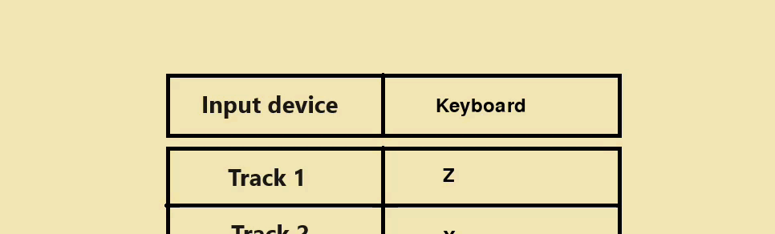
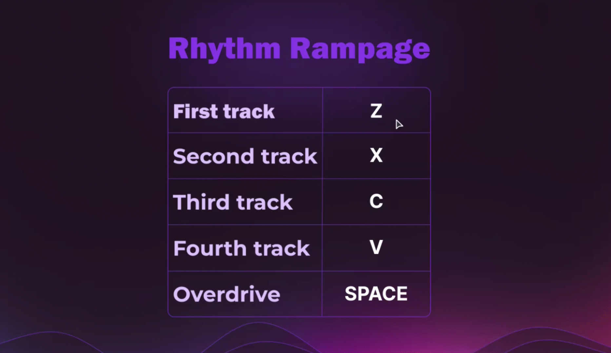

# Rhythm Rampage
### Авторы:

[Андрей Орлов](https://github.com/vokintru)

[Никита Иванников](https://github.com/Nikiton-prog)

### Помогали:

[Zefjrka (Дизайн)](https://github.com/Zefjrka)
   
### Компьютерная ритм игра - *Rhythm Rampage* копия гитар хиро.
*Управление в игре с клавиатуры и геймпада.*

### Описание

 - Игра открывается на весь экран из-за этого в интерфейсе игры предусмотрена кнопка выхода
 - В меню можно выбрать 2 дредустановленых уровня, и запустить кастомный если он установлен
 - В игре нужно в ритм музыке нажимать на 4 клавиши управления (скр. 1)

   (Тут будет скрин (скр. 1))
 - В настройках можно выбрать устройство ввода (Гаймпад Xbox/Клавиатура), геймпады PlayStation не поддерживаются (скр. 2)

 - Каждую клавишу управления можно назначить на другую (скр. 3)

### Технологии в проекте 

Класс *MainMenu* создан для запуска игры, её настройки и выбора уровней

 - Функции *MainMenu*, *ChoiceMenu* и *SettingsMenu* созданы для переключения вкладак меню
 - Весь код изменения клавиш находится в *SettingsMenu* для удобства
 - Функция *check_buttons* отвечает за считывания нажатий кнопок в меню
 - Функция *game_init* отвечает за запуск игры, а также в ней запущен основной цикл
 - Функция *exit* отвечает за выход из игры

Класс *Settings* создан для сохранения настроек в json-файл
